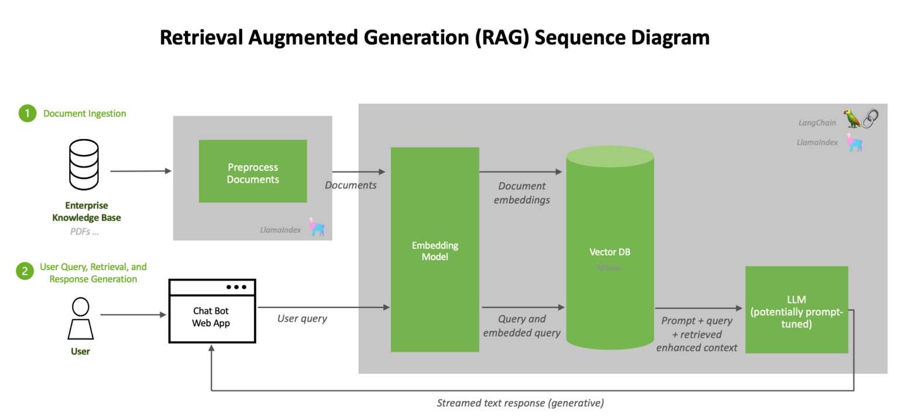

# RAG
Retrieval augmented generation, or RAG, is an architectural approach that can improve the efficacy of large language model (LLM) applications by leveraging custom data. This is done by retrieving data/documents relevant to a question or task and providing them as context for the LLM. RAG has shown success in support chatbots and Q&A systems that need to maintain up-to-date information or access domain-specific knowledge.




# Setup
1. Create Environment
    ```
    conda create -n rag_env python=3.10
    conda activate rag_env
    pip install -r requirements.txt
    ```
1. Add your api keys in the `.env` file

# Usage
1. Change parameters of the script at the top of `main.py`
1. `WEBSITES` should be a list containing all the website urls from which you want to scrape data. (each website url should end with '/'. example 'https://www.google.com/' )
1. The output of the `main.py` changes based on the value of the parameter `QUERY`
    - `QUERY` is a `str`: Returns all retrieved documents
    - `QUERY` is a `list`: Creates a conversational RAG pipeline and askes all the questions in the list.
    - `QUERY` is a `None`: Creates a conversational RAG pipeline and waits for user to enter questions.
1. Running Script
    ```
    python main.py
    ```
